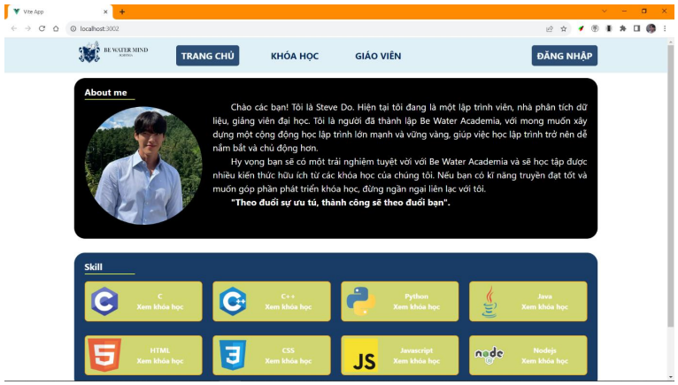
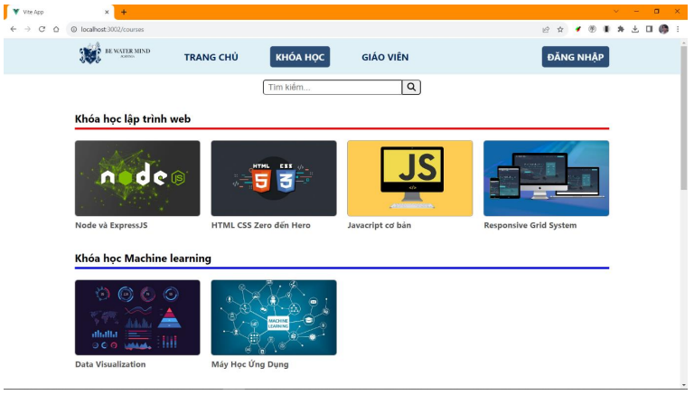
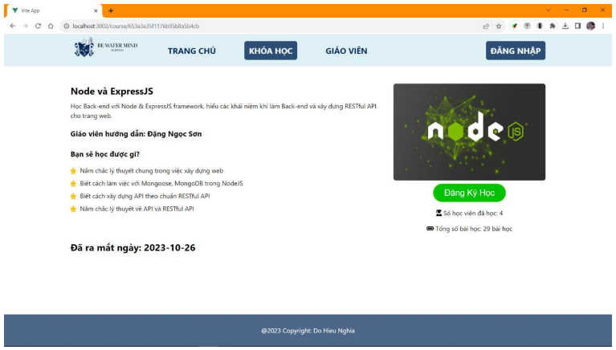
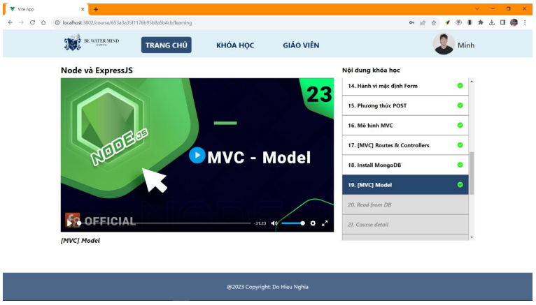
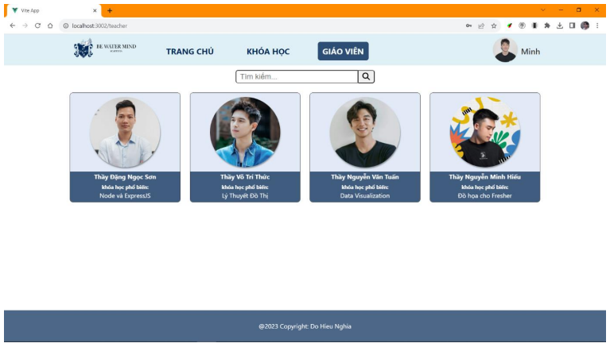
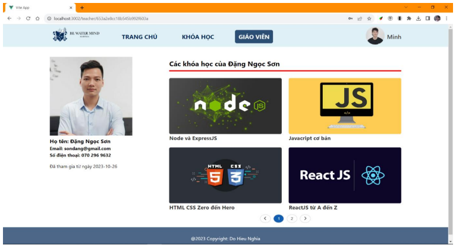

# Thiết kế website cung cấp các khóa học trực tuyến

Ứng dụng web cung cấp các khóa học trực tuyến được tạo ra sử dụng các
framework và thư viện, cơ sở dữ liệu phổ biến: MongoDB, ExpressJS, VueJS, NodeJS… để tiến hành lập trình. Nội dung khóa học là các video bài giảng giúp học viên có thể học tập một cách tiện lợi, ở bất cứ mọi nơi và bất cứ lúc nào.

Các chức năng của hệ thống:
- **Đăng ký, đăng nhập:** Người dùng khách vãng lai có quyền đăng ký để tạo tài khoản học viên, người dùng đăng nhập với ba quyền: học viên, giáo viên, quản trị viên.
- **Xem thông tin chi tiết khóa học:** Người dùng có thể xem các thông tin chi tiết liên quan đến khóa học bao gồm: tên khóa học, giáo viên hướng dẫn, kiến thức đạt được khi hoàn thành khóa học, mô tả về khóa học, số lượng học viên đã đăng ký và tổng số bài học…
- **Đăng ký khóa học:** Học viên đăng ký khóa học để được học từng bài học trong khóa học. Nội dung của khóa học là các video, được hướng dẫn bởi giáo viên.
- **Xem danh sách khóa học mà học viên đã đăng ký:** Danh sách những khóa học mà học viên đã đăng ký cùng với tiến độ - số bài học mà học viên đang học, sẽ được lưu trữ lại để học viên có thể thuận tiện truy cập vào lần đăng nhập sau.
- **Quản lý học viên:** Người dùng quản trị viên thực hiện công tác quản lý hệ thống. Quản trị viên có thể quản lý tất cả học viên của website bao gồm các thông tin: danh sách học viên các khóa học đã đăng ký, cập nhật thông tin học viên, tạm khóa học viên, xóa học viên ra khỏi hệ thống…
- **Quản lý giáo viên:** Cùng với quản lý học viên, quản trị viên cũng có quyền quản lý giáo viên của hệ thống. Các thông tin của giáo viên được quản lý bao gồm: danh sách giáo viên, cập nhật thông tin giáo viên, tạm khóa giáo viên, xóa tài khoản giáo viên khỏi hệ thống…
- **Quản lý khóa học:** Tương tự quản lý người dùng, quản trị viên cũng có quyền quản lý khóa học của hệ thống. Các thông tin của khóa học được quản lý bao gồm: danh sách khóa học, tên khóa học, mô tả khóa học, giáo viên hướng dẫn của mỗi khóa học, kiến thức đạt được khi tham gia khóa học, số lượng bài học, nội dung bài học, số lượng học viên tham gia khóa học, cập nhật thông tin khóa học…

#### Giao diện trang chủ

#### Giao diện trang khóa học

#### Trang chi tiết khóa học

#### Trang xem video bài giảng

#### Trang giáo viên

#### Trang chi tiết giáo viên

## Kết quả đạt được
Sử dụng mô hình MVC để xây dựng và phát triển ứng dụng web, Sử dụng sự hổ trợ của các thư viện: Mongoose, Cloudinary, CORS, Dotenv, JSON web token, SCSS… để phát triển hệ thống. Sử dụng Grid System thiết kế ứng dụng tương thích với nhiều độ rộng màn hình khác nhau, tối ưu hóa trải nghiệm của người dùng trên các thiết bị máy tính bảng, điện thoại di động. Các chức năng của ứng dụng đáp ứng được các yêu cầu cơ bản cho các nhóm người dùng khác nhau.